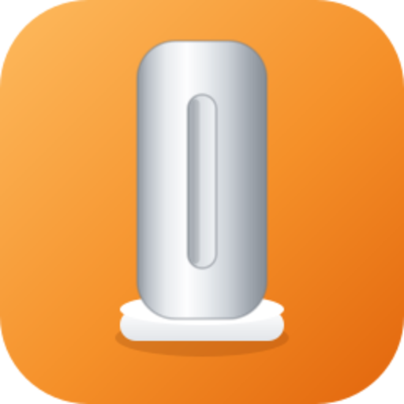
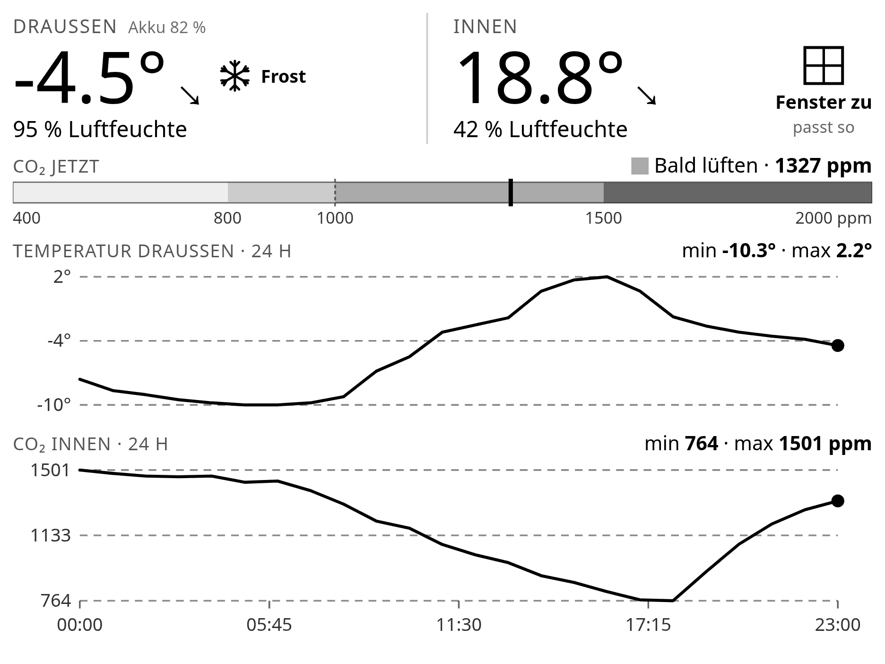
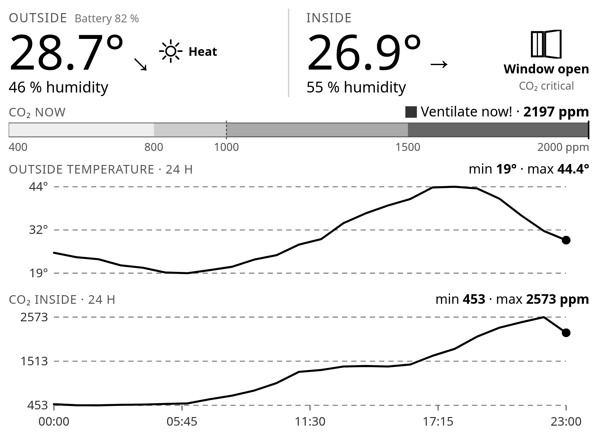

<p align="center">
  
</p>

# Netatmo Wetter & Luftqualität

**TRMNL-Plugin für Netatmo-Wetterstationen über Home Assistant.**
Außen- und Innenklima auf einen Blick, mit CO₂-Ampel, Lüftungsempfehlung und
24-Stunden-Verläufen — entworfen für E-Paper, also ohne Farbe, dafür mit
kräftigen Kontrasten.

> *A TRMNL plugin that renders your Netatmo weather station via Home Assistant:
> indoor/outdoor climate, a CO₂ gauge based on German UBA guideline values,
> a window-open recommendation and 24 h history charts. Labels switchable
> between German and English.*



*19. Februar 2026 — Frost, Tagesgang von −10 °C auf +2 °C und zurück.*

## Was angezeigt wird

| Bereich | Inhalt |
|---|---|
| **Draußen** | Temperatur mit Trendpfeil, Luftfeuchte, Akkustand des Außenmoduls |
| **Innen** | Temperatur mit Trendpfeil, Luftfeuchte |
| **Fenster-Empfehlung** | gezeichnetes Fenster, offen oder geschlossen, mit Begründung |
| **CO₂-Balken** | Skala 400–2000 ppm mit Zonen und Pettenkofer-Marke bei 1000 |
| **Verläufe** | Temperatur außen und CO₂ innen über 24 h, gemeinsame Zeitachse |

Bei Frost oder Hitze erscheint zusätzlich ein Symbol neben der Außentemperatur.
Meldet der Konnektivitätssensor das Außenmodul als offline, ersetzt eine
schwarze Warnung die Akkuanzeige — sonst zeigt das Display stumm veraltete
Werte weiter.



*30. Juli 2026, englische Beschriftung — Hitzewarnung und CO₂ über 2000 ppm.*

## Voraussetzungen

- **TRMNL-Gerät** — entwickelt und getestet auf dem **TRMNL X** (1872 × 1404, 16 Graustufen).
  Auf dem OG (800 × 480, 1 Bit) läuft es, die Diagramme werden dort aber eng.
- **Home Assistant** mit eingerichteter **Netatmo**-Integration
- Ein **Long-Lived Access Token** aus Home Assistant
- Einen Server, der Plugins rendert: **[LaraPaper](https://github.com/usetrmnl/larapaper)**
  oder die TRMNL-Cloud mit `trmnlp`

Es werden **keine Daten an Dritte** übertragen. Der Server holt die Werte
direkt aus deiner Home-Assistant-Instanz.

## Installation

### LaraPaper

1. Repository als ZIP herunterladen
2. In LaraPaper unter **Plugins → Import** hochladen
3. Die Konfigurationsfelder ausfüllen (siehe unten)
4. Plugin in eine Playlist legen

### trmnlp / TRMNL Cloud

```bash
git clone https://github.com/robotter112/TRMNL-Netatmo-Weather
cd TRMNL-Netatmo-Weather
trmnlp serve
```

## Konfiguration

| Feld | Bedeutung | Beispiel |
|---|---|---|
| `lang` | Sprache der Beschriftungen: `de` oder `en` | `en` |
| `ha_url` | Basis-URL von Home Assistant, ohne Schrägstrich am Ende | `http://homeassistant.local:8123` |
| `ha_token` | Long-Lived Access Token | *Profil → Sicherheit* |
| `ent_temp_out` | Temperatur außen | `sensor.netatmo_aussen_temperatur` |
| `ent_hum_out` | Luftfeuchte außen | |
| `ent_temp_in` | Temperatur innen | |
| `ent_hum_in` | Luftfeuchte innen | |
| `ent_co2` | CO₂ innen | |
| `ent_trend_out` | Temperatur-Trend außen (`up`/`down`/`stable`) | |
| `ent_trend_in` | Temperatur-Trend innen | |
| `ent_batt_out` | Batterie Außenmodul | |
| `ent_conn_out` | Konnektivität Außenmodul (Binary Sensor) | |
| `co2_threshold` | Ab wann „Fenster auf" empfohlen wird, in ppm | `1500` |

### Token erzeugen

Home Assistant → unten links auf deinen Namen → **Sicherheit** → ganz unten
**Langlebige Zugriffstokens** → *Token erstellen*. Der Wert erscheint **genau
einmal**.

### Entity-IDs finden

Die Netatmo-Integration benennt Entitäten nach dem Raum, den du in der
Netatmo-App vergeben hast — nicht nach „netatmo". Heißt dein Innenmodul
„Wohnzimmer", entstehen daraus `sensor.wohnzimmer_temperatur`, `sensor.wohnzimmer_kohlendioxid`
und so weiter. Nachschauen unter **Einstellungen → Geräte & Dienste → Netatmo
→ Entitäten**.

## CO₂-Bewertung

Die Skala folgt den Leitwerten des deutschen **Umweltbundesamts**:

| ppm | Bewertung UBA | Anzeige |
|---|---|---|
| < 1000 | hygienisch unbedenklich | *Frische Luft* / *Gut* |
| 1000–2000 | hygienisch auffällig | *Bald lüften* / *Lüften* |
| > 2000 | hygienisch inakzeptabel | *Sofort lüften!* |

Die gestrichelte Linie bei 1000 ppm markiert die **Pettenkofer-Zahl** von 1858,
bis heute der Referenzwert für frei belüftete Räume.

## Lüftungsempfehlung

Geprüft wird in dieser Reihenfolge, die erste zutreffende Regel gewinnt:

| Bedingung | Empfehlung | Begründung |
|---|---|---|
| CO₂ ≥ 2000 | Fenster auf | CO₂ kritisch |
| CO₂ ≥ `co2_threshold` | Fenster auf | CO₂ hoch |
| innen > 23 °C **und** ≥ 1 °C wärmer als außen | Fenster auf | kühlt ab |
| außen > 1 °C wärmer als innen | Fenster zu | draußen wärmer |
| sonst | Fenster zu | passt so |

Luftqualität schlägt Temperatur — über der Schwelle wird immer CO₂ als Grund
genannt, auch wenn zusätzlich das Temperaturargument zuträfe.

## Warnsymbole

| Außentemperatur | Symbol | Text |
|---|---|---|
| ≤ 0 °C | Schneeflocke | Frost |
| ≤ 3 °C | Schneeflocke | Frostgefahr |
| ≥ 27 °C | Sonne | Hitze |
| ≥ 32 °C | Sonne, ausgefüllt | Starke Hitze |

Dazwischen bleibt die Zeile leer.

## Technische Hinweise

- **11 Polling-URLs**, parallel abgerufen. Die Reihenfolge in `settings.yml`
  bestimmt `IDX_0` … `IDX_10` — beim Ändern das Markup mitziehen.
- **Verlaufsdaten** kommen über `/api/history/period` **ohne** Zeitstempel im
  Pfad; Home Assistant liefert dann von selbst die letzten 24 Stunden.
- **Beide Kurven werden nach Zeitstempel positioniert**, nicht nach
  Messpunkt-Nummer. Temperatur und CO₂ haben unterschiedlich viele Punkte und
  dürften sich sonst keine Zeitachse teilen.
- **Zeitzone:** Der Server muss richtig eingestellt sein. Bei LaraPaper
  `APP_TIMEZONE=Europe/Berlin` setzen, sonst zeigt die Zeitachse UTC.
- **Alles ist Liquid und SVG**, kein JavaScript. Die Symbole sind gezeichnet
  statt als Emoji — Farbemoji werden auf 4-Bit-Graustufen zu grauem Matsch.

## Lizenz

MIT — siehe [LICENSE](LICENSE).
